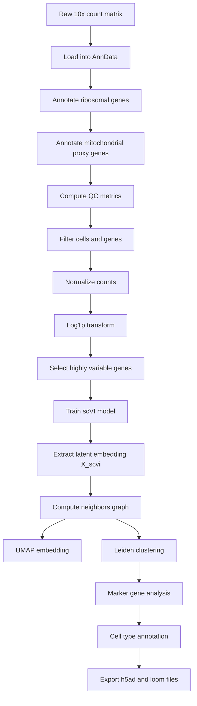

# Single-Cell RNA-seq Analysis Pipeline for *Tribolium castaneum*

> **Publishable-style protocol / methods document**  
> **Document type:** self-contained Markdown  
> **Use cases:** manuscript methods, GitHub README, supplementary protocol, internal lab documentation

---

## Document metadata

**Title:** Single-cell RNA-seq analysis pipeline for *Tribolium castaneum* using Scanpy and scVI  
**Primary analysis framework:** Python, Scanpy, scvi-tools  
**Core novelty:** Tribolium-specific mitochondrial proxy QC strategy and scVI latent embedding in place of PCA  
**Version:** 1.0  
**Prepared for:** the document author  
**Copyright:** © 2026 the document author. All rights reserved.

---

## Abstract

This protocol describes a reproducible single-cell RNA-seq workflow for *Tribolium castaneum* using the Scanpy ecosystem with a learned **scVI latent embedding** in place of conventional PCA. Because the dataset contains only **nuclear TC gene identifiers** and lacks mitochondrial transcript annotations, mitochondrial stress is approximated using a curated set of **Drosophila oxidative phosphorylation orthologs mapped to Tribolium TC IDs**. The workflow proceeds through quality control, filtering, normalization, logarithmic transformation, highly variable gene selection, scVI model training, neighborhood graph construction, UMAP visualization, Leiden clustering, and marker-based annotation. This pipeline is designed to be publication-ready, reproducible, species-aware, and adaptable to future batch-aware analyses.

---

# 1. Overview

## 1.1 Conceptual summary

This workflow differs from a standard Scanpy analysis in two main ways:

1. **Tribolium-specific QC adaptation**  
   Because true mitochondrial transcripts are unavailable in the matrix, a proxy mitochondrial gene panel is used for stress-aware filtering.

2. **scVI replaces PCA**  
   Instead of linear principal components, dimensionality reduction is performed using a variational autoencoder–based latent representation learned by scVI.

This can be summarized as:

> A Scanpy-based single-cell RNA-seq analysis pipeline optimized for *Tribolium castaneum*, incorporating Drosophila-derived mitochondrial proxy genes for quality control and using scVI latent embedding instead of PCA for dimensionality reduction and clustering.

---

## 1.2 Full workflow at a glance

| Stage | Purpose | Main output |
|---|---|---|
| Raw matrix import | Read count matrix into AnnData | `adata` |
| Gene annotation | Mark ribosomal and mitochondrial proxy genes | QC feature labels |
| QC metric computation | Quantify cell-level complexity and stress proxies | QC columns in `adata.obs` |
| Cell/gene filtering | Remove low-quality cells, empty droplets, doublet-like cells, and rare genes | filtered `adata` |
| Normalization | Standardize library size across cells | normalized counts |
| Log transformation | Stabilize variance for downstream feature selection | log-transformed matrix |
| HVG selection | Focus on informative genes | HVG-restricted matrix |
| scVI training | Learn nonlinear latent representation | `X_scvi` |
| Neighbor graph | Capture local manifold structure | graph in `adata.obsp` |
| UMAP | 2D visualization | `X_umap` |
| Leiden clustering | Define cell populations | cluster labels |
| Marker analysis | Identify cluster-defining genes | ranked gene lists |
| Annotation/export | Assign biological identities and save outputs | `.h5ad`, `.loom` |

---

# 2. Workflow structure

## 2.1 Flow diagram



## 2.2 Linear workflow summary

```text
Raw counts → QC → Normalize → Log1p → HVG → scVI embedding → Neighbors → UMAP → Leiden clustering → Marker analysis → Annotation
```

---

# 3. Quality control strategy

## 3.1 Biological rationale

In many standard scRNA-seq workflows, mitochondrial transcript fraction is used as an indicator of cell stress or low-quality capture. However, this dataset contains only **Tribolium nuclear gene identifiers (TC IDs)** and does **not** include mitochondrial genome-derived transcripts. Therefore, a direct mitochondrial percentage metric cannot be computed in the conventional way.

To preserve a stress-aware QC step, this pipeline uses **mitochondrial proxy genes** derived from **Drosophila oxidative phosphorylation orthologs** mapped to *Tribolium castaneum* TC identifiers. These genes represent core mitochondrial energy-production functions and serve as a biologically motivated surrogate for mitochondrial stress burden.

## 3.2 Proxy mitochondrial gene categories

The curated proxy panel includes genes associated with:

- cytochrome c oxidase subunits
- ATP synthase subunits
- electron transport chain components
- respiratory chain assembly factors

## 3.3 Proxy mitochondrial gene list

```python
STRICT_MT_TC = {
    "TC009512","TC001862","TC009255","TC009596","TC015888","TC000453",
    "TC005368","TC011750","TC030047","TC030048","TC003306","TC006526",
    "TC010331","TC009556","TC011455","TC015454","TC003886","TC004872",
    "TC009033","TC005628","TC008513","TC000462","TC015322","TC013931",
    "TC009010","TC008728"
}
```

## 3.4 QC metrics used

| Metric | Meaning | Interpretation |
|---|---|---|
| `n_genes_by_counts` | Number of detected genes per cell | low values suggest poor-quality droplets; very high values may indicate doublets |
| `total_counts` | Total UMIs/counts per cell | low values suggest empty droplets or damaged cells |
| `pct_counts_mt` | Percentage of counts from mitochondrial proxy genes | proxy stress indicator, not true mitochondrial fraction |
| `pct_counts_ribo` | Percentage of counts from ribosomal genes | may reflect translational activity or technical bias |

## 3.5 Implementation example

```python
import scanpy as sc

adata.var["mt_proxy"] = adata.var_names.isin(STRICT_MT_TC)
adata.var["ribosomal"] = adata.var_names.str.contains(r"^Rp[SL]", regex=True)

sc.pp.calculate_qc_metrics(
    adata,
    qc_vars=["mt_proxy", "ribosomal"],
    percent_top=None,
    log1p=False,
    inplace=True
)
```

---

# 4. Filtering thresholds

## 4.1 Optimized filtering parameters

Filtering thresholds were initially guided by Drosophila/FlyAtlas-style scRNA-seq quality control conventions and then tuned iteratively according to QC distributions and cluster stability.

```python
DEFAULT_MIN_GENES = 800
DEFAULT_MIN_COUNTS = 1500
DEFAULT_MAX_GENES = 4000
DEFAULT_MIN_CELLS_PER_GENE = 5
```

## 4.2 Threshold interpretation

| Parameter | Role | Biological / technical reason |
|---|---|---|
| `MIN_GENES = 800` | minimum detected genes per cell | removes low-complexity droplets and low-information cells |
| `MIN_COUNTS = 1500` | minimum total counts per cell | filters likely empty droplets or damaged cells |
| `MAX_GENES = 4000` | maximum detected genes per cell | helps exclude potential doublets or multiplets |
| `MIN_CELLS_PER_GENE = 5` | minimum number of cells expressing a gene | removes rare/noisy genes with weak support |

## 4.3 Filtering code

```python
sc.pp.filter_cells(adata, min_genes=800)
sc.pp.filter_cells(adata, min_counts=1500)
adata = adata[adata.obs["n_genes_by_counts"] <= 4000].copy()
sc.pp.filter_genes(adata, min_cells=5)
```

---

# 5. Normalization and transformation

## 5.1 Normalization

Counts are normalized to a total of **10,000 counts per cell**.

```python
sc.pp.normalize_total(adata, target_sum=1e4)
```

## 5.2 Log transformation

A natural log transform with pseudocount 1 is applied using `log1p`.

```python
sc.pp.log1p(adata)
```

## 5.3 Purpose

| Step | Why it is used |
|---|---|
| total-count normalization | reduces library-size differences across cells |
| log1p transform | stabilizes variance and compresses the dynamic range |

---

# 6. Highly variable gene selection

Highly variable genes (HVGs) were selected prior to latent embedding in order to emphasize informative biological variation.

```python
N_TOP_HVGS = 2500

sc.pp.highly_variable_genes(
    adata,
    n_top_genes=N_TOP_HVGS,
    flavor="seurat_v3"
)
adata = adata[:, adata.var.highly_variable].copy()
```

## 6.1 Why HVGs are retained

HVG selection:

- reduces noise from uninformative genes
- improves computational efficiency
- focuses the latent model on biologically structured variation
- often improves neighborhood graph quality and clustering robustness

---

# 7. scVI latent embedding

## 7.1 Why scVI is used instead of PCA

This workflow uses **scVI** in place of PCA for dimensionality reduction.

### Advantages of scVI in this pipeline

| Advantage | Relevance |
|---|---|
| nonlinear latent representation | captures complex gene–gene relationships beyond linear structure |
| count-aware modeling | better suited to sparse UMI-based scRNA-seq data |
| over-dispersion handling | appropriate for single-cell count distributions |
| latent biological embedding | useful for clustering and visualization |
| batch-aware design | enables future correction if batch structure is present |
| transfer learning potential | supports later atlas-style mapping or model reuse |

## 7.2 Conceptual note

scVI is a probabilistic deep generative model for single-cell transcriptomics. In scvi-tools documentation, scVI is described as learning a latent representation via variational inference, and the model output can be directly used for neighborhood graph construction and downstream clustering. The latent representation is typically stored as `X_scvi`.

## 7.3 scVI training example

```python
import scvi

# if no batch variable exists, batch_key can be omitted
scvi.model.SCVI.setup_anndata(adata, batch_key="batch")

model = scvi.model.SCVI(adata, n_latent=30)
model.train()

adata.obsm["X_scvi"] = model.get_latent_representation()
```

## 7.4 Final dimensionality parameters

```python
N_TOP_HVGS = 2500
N_PCS = 30      # used here as latent dimensionality analogue
N_NEIGHBORS = 12
LEIDEN_RES = 0.40
UMAP_MIN_DIST = 0.25
```

---

# 8. Graph construction, visualization, and clustering

## 8.1 Neighbor graph

The neighborhood graph is computed from the scVI latent representation rather than from PCA coordinates.

```python
sc.pp.neighbors(adata, n_neighbors=12, use_rep="X_scvi")
```

## 8.2 UMAP visualization

```python
sc.tl.umap(adata, min_dist=0.25)
```

## 8.3 Leiden clustering

```python
sc.tl.leiden(adata, resolution=0.40)
```

## 8.4 Parameter meaning

| Parameter | Value | Meaning |
|---|---:|---|
| `n_latent` | 30 | scVI latent dimensions used instead of PCA axes |
| `n_neighbors` | 12 | local graph connectivity used for clustering/UMAP |
| `resolution` | 0.40 | cluster granularity for Leiden |
| `min_dist` | 0.25 | compactness of UMAP structure |

---

# 9. Marker gene analysis and annotation

Following Leiden clustering, cluster-enriched genes are identified using differential expression testing.

```python
sc.tl.rank_genes_groups(
    adata,
    groupby="leiden",
    method="wilcoxon"
)
```

## 9.1 Annotation strategy

Cell populations are annotated using:

- ranked marker genes per cluster
- predefined marker gene sets
- known orthologous biology where available
- cross-cluster consistency of marker expression

## 9.2 Annotation logic

| Step | Purpose |
|---|---|
| rank markers per cluster | identify distinguishing genes |
| compare to marker sets | infer likely cell identities |
| inspect expression patterns | validate annotation consistency |
| refine labels iteratively | improve biological confidence |

---

# 10. End-to-end code skeleton

```python
import scanpy as sc
import scvi

# 1. load data
adata = sc.read_10x_h5("filtered_feature_bc_matrix.h5")

# 2. annotate genes
STRICT_MT_TC = {
    "TC009512","TC001862","TC009255","TC009596","TC015888","TC000453",
    "TC005368","TC011750","TC030047","TC030048","TC003306","TC006526",
    "TC010331","TC009556","TC011455","TC015454","TC003886","TC004872",
    "TC009033","TC005628","TC008513","TC000462","TC015322","TC013931",
    "TC009010","TC008728"
}

adata.var["mt_proxy"] = adata.var_names.isin(STRICT_MT_TC)
adata.var["ribosomal"] = adata.var_names.str.contains(r"^Rp[SL]", regex=True)

# 3. QC metrics
sc.pp.calculate_qc_metrics(
    adata,
    qc_vars=["mt_proxy", "ribosomal"],
    percent_top=None,
    log1p=False,
    inplace=True
)

# 4. filtering
sc.pp.filter_cells(adata, min_genes=800)
sc.pp.filter_cells(adata, min_counts=1500)
adata = adata[adata.obs["n_genes_by_counts"] <= 4000].copy()
sc.pp.filter_genes(adata, min_cells=5)

# 5. normalize and log
sc.pp.normalize_total(adata, target_sum=1e4)
sc.pp.log1p(adata)

# 6. HVG selection
sc.pp.highly_variable_genes(adata, n_top_genes=2500, flavor="seurat_v3")
adata = adata[:, adata.var.highly_variable].copy()

# 7. scVI
if "batch" in adata.obs.columns:
    scvi.model.SCVI.setup_anndata(adata, batch_key="batch")
else:
    scvi.model.SCVI.setup_anndata(adata)

model = scvi.model.SCVI(adata, n_latent=30)
model.train()
adata.obsm["X_scvi"] = model.get_latent_representation()

# 8. neighbors / UMAP / Leiden
sc.pp.neighbors(adata, n_neighbors=12, use_rep="X_scvi")
sc.tl.umap(adata, min_dist=0.25)
sc.tl.leiden(adata, resolution=0.40)

# 9. marker genes
sc.tl.rank_genes_groups(adata, groupby="leiden", method="wilcoxon")

# 10. save
adata.write("tribolium_scvi_pipeline.h5ad")
adata.write_loom("tribolium_scvi_pipeline.loom")
```

---

# 11. Methods paragraph for manuscript use

## 11.1 Full methods-style paragraph

Single-cell RNA-seq data from *Tribolium castaneum* were analyzed using the Scanpy framework with scVI-based latent embedding. Quality control included filtering by detected gene number, total UMI counts, and a proxy mitochondrial stress metric derived from Drosophila oxidative phosphorylation orthologs mapped to Tribolium TC identifiers, because true mitochondrial transcripts were not present in the nuclear-gene count matrix. Cells were retained if they contained 800–4000 detected genes and at least 1500 total counts, and genes were retained if expressed in at least 5 cells. Data were normalized to 10,000 counts per cell and log-transformed. Highly variable genes were selected (`n = 2500`) and used for scVI model training. Instead of PCA, dimensionality reduction was performed using a 30-dimensional scVI latent embedding, followed by neighborhood graph construction (`n_neighbors = 12`), UMAP visualization (`min_dist = 0.25`), and Leiden clustering (`resolution = 0.40`). Marker genes were identified using the Wilcoxon rank-sum test, and clusters were annotated based on predefined marker sets and orthology-informed biological interpretation.

## 11.2 Shorter methods-style paragraph

Single-cell RNA-seq data were processed using Scanpy with scVI latent embedding. Quality control included filtering by gene counts, UMI counts, and a Tribolium-specific mitochondrial proxy score based on Drosophila oxidative phosphorylation orthologs mapped to TC IDs. Cells with 800–4000 detected genes and at least 1500 counts were retained, and genes expressed in fewer than 5 cells were removed. Data were normalized, log-transformed, and reduced to 2500 highly variable genes. Dimensionality reduction was performed using scVI (`n_latent = 30`) rather than PCA, followed by neighbor graph construction, UMAP visualization, Leiden clustering, and Wilcoxon-based marker analysis.

---

# 12. Novelty highlights

## 12.1 Technical novelty

| Novel element | Why it matters |
|---|---|
| Tribolium-adapted QC design | avoids relying on unavailable mitochondrial transcripts |
| Drosophila-derived oxidative phosphorylation proxy panel | provides biologically grounded stress-aware filtering |
| scVI in place of PCA | introduces nonlinear, count-aware latent representation |
| batch-ready framework | supports future multi-sample or cross-condition expansion |
| publication-style documentation | improves reproducibility and transferability |

## 12.2 Suggested highlight sentence

> This workflow introduces a species-adapted quality-control strategy for *Tribolium castaneum* single-cell RNA-seq and replaces PCA with a deep generative scVI latent representation to improve biologically meaningful clustering.

---

# 13. Reproducibility checklist

| Item | Recommendation |
|---|---|
| raw matrix source | record exact input file name and origin |
| software versions | save Python / Scanpy / scvi-tools versions |
| random seeds | fix seed values where possible |
| filtering thresholds | report exact cell/gene cutoffs |
| gene list provenance | archive the mitochondrial proxy mapping table |
| output objects | save processed `.h5ad` and cluster annotations |
| annotation evidence | keep marker-gene tables for each cluster |

---

# 14. References

1. Lopez R, Regier J, Cole MB, Jordan MI, Yosef N. Deep generative modeling for single-cell transcriptomics. *Nature Methods*. 2018;15:1053–1058. doi:10.1038/s41592-018-0229-2.
2. scvi-tools documentation: SCVI model user guide, dimensionality reduction and latent representation usage.
3. Scanpy documentation for preprocessing, neighborhood graph construction, UMAP, Leiden clustering, and marker ranking.

---

# 15. Rights and usage note

This Markdown document is an **original editorial compilation** prepared for the document author. It is written in a publication-ready style and does **not** reproduce third-party figures or copyrighted article images. Scientific concepts referring to scVI and standard single-cell analysis procedures are attributed in the references section. Before formal journal submission, the author should update software versions, dataset accession information, and any final citation formatting required by the target journal.

